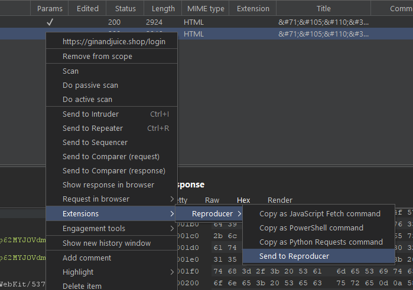
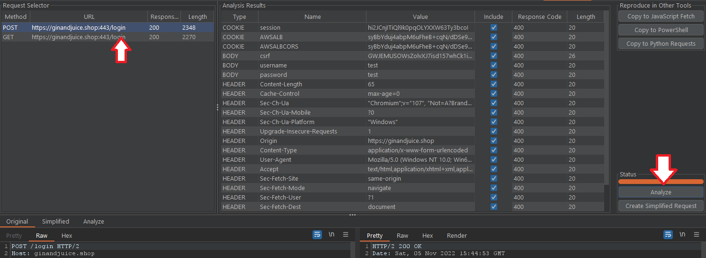
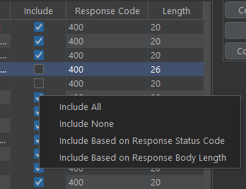

# Reproducer, Request Simplification and PoC Builder
This extension aids in simplifying and formatting requests to aid in finding reproduction and proof of concept creation.

# Installation
- Download the latest jar file from https://github.com/rsmusllp/BurpSuiteReproducer/releases
- In Burp Suite under "Extender" -> "Extensions" -> "Add" select the downloaded file.

# Usage
Send a request to the extension through the "Send to Reproducer" option in the right click context menu.

Select a request in the "Request Selector" table and click the "Analyze" button. This will remove headers, cookies, and parameters and show the response code and response body length.

You can look at the request and response with the header, cookie, or parameter removed by selecting the item in the "Analysis Results" table and then clicking the "Analyze" tab.

To generate the final simplified request you can select what to include or not include by selecting the checkbox for the item. There are also several useful functions to auto include based on status code or length in the right click context menu.

Once you are ready to test your simplified request you can click the "Create Simplified Request" button. This will remove the items that are not included and send the request. Results can be viewed in the "Simplified" request/response viewer tab.

You can then right-click on the simplified request and use the built-in "Copy to Curl" or use one of the "Reproduce in Other Tools" features.

# Bug Reporting
Any issues created for bugs encountered while using the extension would be greatly appreciated.
Please describe steps to reproduce the bug and copy any errors in the extender error log.